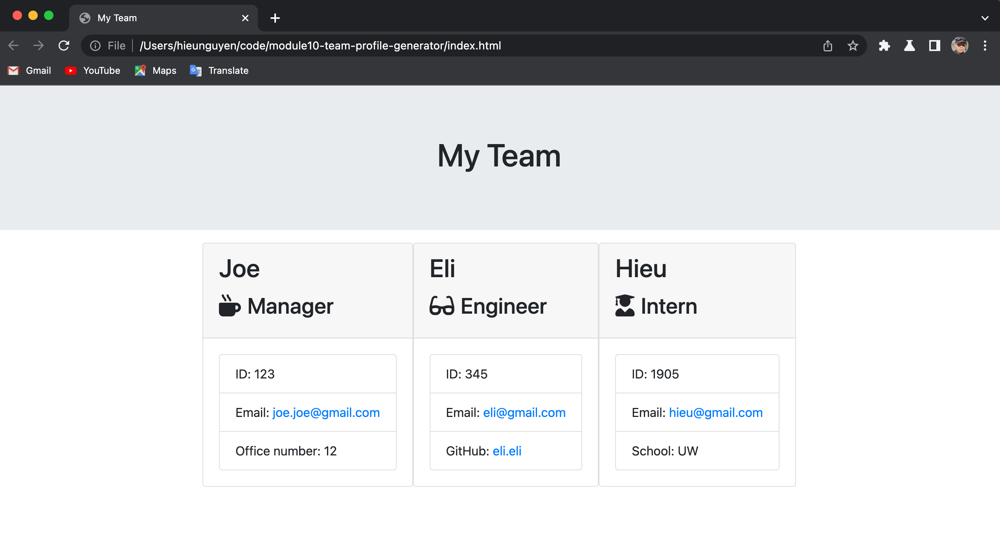

# module10-team-profile-generator

## Description

- This application will generate HTML page base on the user iput.

## Installation

- This application does not have a deloyed link, please install node.js and run the comman node generateHtml.js

## Feature 

- This application will ask for employee information and roll and user can add as many employee as they need before quiting the application to generate HTML page.